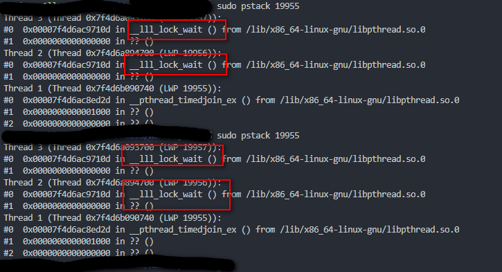

# 多进程与多线程

## 多进程调试

```
#include <stdio.h>
#include <stdlib.h>
#include <unistd.h>

int main(void) {
    pid_t pid;

    pid = fork();
    if (pid < 0)
    {
        exit(1);
    }
    else if (pid > 0)
    {
        printf("Parent\n");
        exit(0);
    }
    printf("Child\n");
    return 0;
}
```

### 调试子进程

在调试多进程程序时，gdb 默认会追踪父进程。例如：

```
(gdb) start
Temporary breakpoint 1 at 0x748: file main.cpp, line 8.
Starting program: /mnt/Work/test/main 

Temporary breakpoint 1, main () at main.cpp:8
8           pid = fork();
(gdb) n
Child
9           if (pid < 0)
(gdb) 
13          else if (pid > 0)
(gdb) 
15              printf("Parent\n");
(gdb) 
Parent
16              exit(0);
```

可以看到第 8 行时子进程执行了。

如果要调试子进程，要使用如下命令：

```
set follow-fork-mode child
```

例如：

```
(gdb) set follow-fork-mode child
(gdb) start
Temporary breakpoint 1 at 0x748: file main.cpp, line 8.
Starting program: /mnt/Hello/Work/cy/test/main 

Temporary breakpoint 1, main () at main.cpp:8
8           pid = fork();
(gdb) n
[New process 14735]
Parent
[Switching to process 14735]
main () at main.cpp:9
9           if (pid < 0)
(gdb) n
13          else if (pid > 0)
(gdb) n
18          printf("Child\n");
(gdb) n
Child
19          return 0;
```

可以看到程序执行到第18行：子进程打印 “Child”。

## 多线程调试

```
#include <stdio.h>
#include <unistd.h>
#include <pthread.h>
#include <stdlib.h>
#include <string.h>

void* pthread_run1(void* arg)
{
    (void)arg;

    while(1)
    {
        printf("I am thread1,ID: %lu\n",pthread_self());
        sleep(1);
    }
}

void* pthread_run2(void* arg)
{
    (void)arg;

    while(1)
    {
        printf("I am thread2,ID: %lu\n",pthread_self());
        sleep(1);
    }
}


int main()
{

    pthread_t tid1;
    pthread_t tid2;

    pthread_create(&tid1,NULL,pthread_run1,NULL);
    pthread_create(&tid2,NULL,pthread_run2,NULL);

    printf("I am main thread\n");

    pthread_join(tid1,NULL);
    pthread_join(tid2,NULL);
    return 0;
}
```

编译：

```
g++ -o test test.cpp -g -lpthread
```

编译后执行，查看一下进程和线程 ID：

```
ps -aux | grep test #@ 查看当前的进程
18937  0.0  0.0  23084   872 pts/6    Sl+  22:32   0:00 ./test

ps -aL | grep test #@ 查看当前的轻量级进程
18937 18937 pts/6    00:00:00 test
18937 18938 pts/6    00:00:00 test
18937 18939 pts/6    00:00:00 test

pstree -p 18937 #@ 查看主线程和子线程的关系
test(18937)-+-{test}(18938)
            `-{test}(18939)
```

### 线程栈结构的查看

attach 到已经运行的线程：

```
gdb attach 18937
```

查看进程信息 info inferiors：

```
(gdb) info inferiors  #@ 查看进程信息
  Num  Description       Executable        
* 1    process 18937     /mnt/Work/test 		#@ 只有一个进程
```

查看线程 info threads：

```
(gdb) info threads  #@ 查看线程信息
  Id   Target Id         Frame 
* 1    Thread 0x7f313ce6e740 (LWP 18937) "test" 0x00007f313ca6cd2d in __GI___pthread_timedjoin_ex (threadid=139849443518208, thread_return=0x0, 
    abstime=0x0, block=<optimized out>) at pthread_join_common.c:89
  2    Thread 0x7f313c672700 (LWP 18938) "test" 0x00007f313c7579d0 in __GI___nanosleep (requested_time=requested_time@entry=0x7f313c671ea0, 
    remaining=remaining@entry=0x7f313c671ea0) at ../sysdeps/unix/sysv/linux/nanosleep.c:28
  3    Thread 0x7f313be71700 (LWP 18939) "test" 0x00007f313c7579d0 in __GI___nanosleep (requested_time=requested_time@entry=0x7f313be70ea0, 
    remaining=remaining@entry=0x7f313be70ea0) at ../sysdeps/unix/sysv/linux/nanosleep.c:28
```

查看当前线程的栈结构 bt，默认是主线程：

```
(gdb) bt  #@ 默认是主线程
#0  0x00007f313ca6cd2d in __GI___pthread_timedjoin_ex (threadid=139849443518208, thread_return=0x0, abstime=0x0, block=<optimized out>)
    at pthread_join_common.c:89
#1  0x0000563b2ab829a0 in main () at test.cpp:41
```

切换线程 thread n (n 表示第几个线程)：

```
(gdb) thread 2			#@ 切换到线程 2
[Switching to thread 2 (Thread 0x7f313c672700 (LWP 18938))]
#0  0x00007f313c7579d0 in __GI___nanosleep (requested_time=requested_time@entry=0x7f313c671ea0, remaining=remaining@entry=0x7f313c671ea0)
    at ../sysdeps/unix/sysv/linux/nanosleep.c:28
28      ../sysdeps/unix/sysv/linux/nanosleep.c: No such file or directory.
(gdb) bt	#@ 查看线程2的栈结构
#0  0x00007f313c7579d0 in __GI___nanosleep (requested_time=requested_time@entry=0x7f313c671ea0, remaining=remaining@entry=0x7f313c671ea0)
    at ../sysdeps/unix/sysv/linux/nanosleep.c:28
#1  0x00007f313c7578aa in __sleep (seconds=0) at ../sysdeps/posix/sleep.c:55
#2  0x0000563b2ab828ff in pthread_run1 (arg=0x0) at test.cpp:14
#3  0x00007f313ca6b6db in start_thread (arg=0x7f313c672700) at pthread_create.c:463
#4  0x00007f313c79488f in clone () at ../sysdeps/unix/sysv/linux/x86_64/clone.S:95
```

### 设置线程锁定模式

用 gdb 调试多线程程序时，一旦程序断住，所有的线程都处于暂停状态。此时当你调试其中一个线程时（比如执行 step，next 命令），所有的线程都会同时执行。可以通过 set scheduler 来进行控制：

```
set scheduler-locking   off | on | step  
```

- on：只有当前调试线程运行，其他线程处于暂停状态。
- off：当前调试线程外的其他线程一直在正常运行。
- step：其他线程跟随当前调试线程运行，但具体怎么协同运行，测试中无法体现。

查看当前锁定线程的模式：

```
show scheduler-locking
```

## 调试多线程死锁

```
#include <stdio.h>
#include <pthread.h>
#include <stdlib.h>
#include <unistd.h>

static int sequence1 = 0;
static int sequence2 = 0;

pthread_mutex_t lock1;
pthread_mutex_t lock2;

int func1()
{
    pthread_mutex_lock(&lock1);
    ++sequence1;
    sleep(1);
    pthread_mutex_lock(&lock2);
    ++sequence2;
    printf("this is thread 1\n");
    pthread_mutex_unlock(&lock2);
    pthread_mutex_unlock(&lock1);

    return sequence1;
}

int func2()
{
    pthread_mutex_lock(&lock2);
    ++sequence2;
    sleep(1);
    pthread_mutex_lock(&lock1);
    ++sequence2;
    printf("this is thread 2\n");
    pthread_mutex_unlock(&lock1);
    pthread_mutex_unlock(&lock2);

    return sequence1;
}


void* thread1(void *arg)
{
    int rev = 0;
    while(1)
    {
        rev = func1();
        sleep(1);
    }
}

void* thread2(void *arg)
{
    int rev = 0;
    while(1)
    {
        rev = func2();
        sleep(1);
    }
}

int main()
{
    printf("main thread running \n");

    pthread_t tid[2];

    pthread_mutex_init(&lock1, NULL);
    pthread_mutex_init(&lock2, NULL);

    if(pthread_create(&tid[0], NULL, &thread1, NULL) != 0)
    {
        printf("create thread 1 failed \n");
        _exit(1);
    }

    if(pthread_create(&tid[1], NULL, &thread2, NULL) != 0)
    {
        printf("create thread 2 failed \n");
        _exit(1);
    }

    pthread_join(tid[0], NULL);
    pthread_join(tid[1], NULL);
    pthread_mutex_destroy( &lock1 );
    pthread_mutex_destroy( &lock2 );

    return 0;
}
```

编译后执行。

查看进程号，并使用 gdb attach：

```
sudo gdb attach 19955   #@ 已知 pid 199955
```

### pstack

pstack 是一个基于 GDB 的脚本命令，可显示每个进程的栈跟踪。pstack  命令必须由相应进程的属主或  root  运行。可以使 用  pstack 来确定进程挂起的位置。此命令允许使用的唯一选项是要检查的进程的 PID。

可以直接将下面的脚本保存为 pstack 拷贝到   /usr/bin/ 目录下：

```
#!/bin/sh

if test $# -ne 1; then
    echo "Usage: `basename $0 .sh` <process-id>" 1>&2
    exit 1
fi

if test ! -r /proc/$1; then
    echo "Process $1 not found." 1>&2
    exit 1
fi

# GDB doesn't allow "thread apply all bt" when the process isn't
# threaded; need to peek at the process to determine if that or the
# simpler "bt" should be used.

backtrace="bt"
if test -d /proc/$1/task ; then
    # Newer kernel; has a task/ directory.
    if test `/bin/ls /proc/$1/task | /usr/bin/wc -l` -gt 1 2>/dev/null ; then
	backtrace="thread apply all bt"
    fi
elif test -f /proc/$1/maps ; then
    # Older kernel; go by it loading libpthread.
    if /bin/grep -e libpthread /proc/$1/maps > /dev/null 2>&1 ; then
	backtrace="thread apply all bt"
    fi
fi

GDB=${GDB:-/usr/bin/gdb}

if $GDB -nx --quiet --batch --readnever > /dev/null 2>&1; then
    readnever=--readnever
else
    readnever=
fi

# Run GDB, strip out unwanted noise.
$GDB --quiet $readnever -nx /proc/$1/exe $1 <<EOF 2>&1 | 
set width 0
set height 0
set pagination no
$backtrace
EOF
/bin/sed -n \
    -e 's/^\((gdb) \)*//' \
    -e '/^#/p' \
    -e '/^Thread/p'
```

注：如果 gdb 命令不在标准路径  /usr/bin/ 下，使用前需要先编辑 pstack 脚本，写入正确的 gdb 路径。

连续多次查看这个进程的函数调用关系堆栈进行分析：当进程吊死时，多次使用  pstack  查看进程的函数调用堆栈，死锁线程将一直处于等锁的状态，对比多次的函数调用堆栈输出结果。



### gdb 调试分析死锁

查看一下线程信息：

```
(gdb) i threads
  Id   Target Id         Frame 
* 1    Thread 0x7f4d6b090740 (LWP 19955) "main" 0x00007f4d6ac8ed2d in __GI___pthread_timedjoin_ex (
    threadid=139970476590848, thread_return=0x0, abstime=0x0, block=<optimized out>)
    at pthread_join_common.c:89
  2    Thread 0x7f4d6a894700 (LWP 19956) "main" __lll_lock_wait ()
    at ../sysdeps/unix/sysv/linux/x86_64/lowlevellock.S:135
  3    Thread 0x7f4d6a093700 (LWP 19957) "main" __lll_lock_wait ()
    at ../sysdeps/unix/sysv/linux/x86_64/lowlevellock.S:135
```

切换到线程 2，并查看堆栈信息：

```
(gdb) thread 2
[Switching to thread 2 (Thread 0x7f4d6a894700 (LWP 19956))]
#0  __lll_lock_wait () at ../sysdeps/unix/sysv/linux/x86_64/lowlevellock.S:135
135     ../sysdeps/unix/sysv/linux/x86_64/lowlevellock.S: 没有那个文件或目录.
(gdb) bt
#0  __lll_lock_wait () at ../sysdeps/unix/sysv/linux/x86_64/lowlevellock.S:135
#1  0x00007f4d6ac90023 in __GI___pthread_mutex_lock (mutex=0x556c26dbb080 <lock2>)
    at ../nptl/pthread_mutex_lock.c:78
#2  0x0000556c26bb9a05 in func1 () at main.cpp:17
#3  0x0000556c26bb9ac8 in thread1 (arg=0x0) at main.cpp:46
#4  0x00007f4d6ac8d6db in start_thread (arg=0x7f4d6a894700) at pthread_create.c:463
#5  0x00007f4d6a9b688f in clone () at ../sysdeps/unix/sysv/linux/x86_64/clone.S:95
```

查看第二个栈帧：

```
(gdb) f 2
#2  0x0000556c26bb9a05 in func1 () at main.cpp:17
17          pthread_mutex_lock(&lock2);
(gdb) info  frame
```

汇总一下上面的信息：

- 线程 2 的 pid 为 19956，正在尝试获取 lock2。

同样的方法操作线程3，可以得到的信息：

- 线程 2 的 pid 为 19957，正在尝试获取 lock1。

此时，我们打印出 lock 的信息：

```
(gdb) p lock1
$1 = pthread_mutex_t = {Type = Normal, Status = Acquired, possibly with waiters, Owner ID = 19956, 
  Robust = No, Shared = No, Protocol = None}
(gdb) p lock2
$2 = pthread_mutex_t = {Type = Normal, Status = Acquired, possibly with waiters, Owner ID = 19957, 
  Robust = No, Shared = No, Protocol = None}
```

我们可以知道：

- lock1 被线程 19956 拥有，即线程 2 拥有。
- lock2 被线程 19957 拥有，即线程 3 拥有。

于是：

- 线程 2 拥有 lock1，并想获取 lock2。
- 线程 3 拥有 lock2，并想获取 lock1。

这就是死锁，本质上是因为上锁的顺序不一致导致此问题的。


