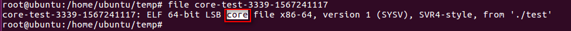

# coredump

## core文件

通常情况下，core 文件会包含了程序运行时的内存，寄存器状态，堆栈指针，内存管理信息还有各种函数调用堆栈信息等，我们可以理解为是程序工作当前状态存储生成第一个文件，许多的程序出错的时候都会产生一个core文件，通过工具分析这个文件，我们可以定位到程序异常退出的时候对应的堆栈调用等信息，找出问题所在。

### 验证一个文件是否是core文件

#### readelf 命令

在类 unix 系统下，core 文件本身主要的格式也是 ELF 格式，因此，我们可以通过 readelf 命令进行判断：

```
readelf -h filename
```


#### file 命令

也可以使用 file 命令查看：

```
file filename
```


## cored文件产生的几种可能情况

造成程序 core 文件的原因有很多，这里总结一些比较常见的情况：

### 内存访问越界

- 由于使用错误的下标，导致数组访问越界。
- 搜索字符串时，依靠字符串结束符来判断字符串是否结束，但是字符串没有正常的使用结束符。
- 使用 `strcpy, strcat, sprintf, strcmp,strcasecmp` 等字符串操作函数，将目标字符串读/写爆。应该使用 `strncpy, strlcpy, strncat, strlcat, snprintf, strncmp, strncasecmp` 等函数防止读写越界。

### 多线程程序使用了线程不安全的函数

应该使用下面这些可重入的函数，它们很容易被用错：

```
asctime_r(3c) gethostbyname_r(3n) getservbyname_r(3n)ctermid_r(3s) gethostent_r(3n) getservbyport_r(3n) ctime_r(3c) getlogin_r(3c)getservent_r(3n) fgetgrent_r(3c) getnetbyaddr_r(3n) getspent_r(3c)fgetpwent_r(3c) getnetbyname_r(3n) getspnam_r(3c) fgetspent_r(3c)getnetent_r(3n) gmtime_r(3c) gamma_r(3m) getnetgrent_r(3n) lgamma_r(3m) getauclassent_r(3)getprotobyname_r(3n) localtime_r(3c) getauclassnam_r(3) etprotobynumber_r(3n)nis_sperror_r(3n) getauevent_r(3) getprotoent_r(3n) rand_r(3c) getauevnam_r(3)getpwent_r(3c) readdir_r(3c) getauevnum_r(3) getpwnam_r(3c) strtok_r(3c) getgrent_r(3c)getpwuid_r(3c) tmpnam_r(3s) getgrgid_r(3c) getrpcbyname_r(3n) ttyname_r(3c)getgrnam_r(3c) getrpcbynumber_r(3n) gethostbyaddr_r(3n) getrpcent_r(3n)
```

### 多线程读写的数据未加锁保护

对于会被多个线程同时访问的全局数据，应该注意加锁保护，否则很容易造成 coredump。

### 非法指针

- 使用空指针
- 随意使用指针转换。一个指向一段内存的指针，除非确定这段内存原先就分配为某种结构或类型，或者这种结构或类型的数组，否则不要将它转换为这种结构或类型的指针，而应该将这段内存拷贝到一个这种结构或类型中，再访问这个结构或类型。这是因为如果这段内存的开始地址不是按照这种结构或类型对齐的，那么访问它时就很容易因为 bus error 而 core dump。

### 堆栈溢出 

不要使用大的局部变量（因为局部变量都分配在栈上），这样容易造成堆栈溢出，破坏系统的栈和堆结构，导致出现莫名其妙的错误。

## core 文件生成设置

### 查看和设置core文件大小限制

#### 查看core文件大小限制

列出所有资源的限制：

```
ulimit -a
```


`core file size` 如果是0表示程序出错时不会产生core文件。

只查看 core 文件大小限制，可以直接使用：

```
ulimit -c
```

#### 设置core文件大小限制

```
ulimit -c size
```

尽量将这个文件大小设置得大一些，程序崩溃时生成 Core 文件大小即为程序运行时占用的内存大小。可能发生堆栈溢出的时候，占用更大的内存。

例如，设置成：

```
ulimit -c unlimited
```

但当前设置的 unlimited 只对当前会话有效，若想系统均有效，则需要在 `/etc/profile` 文件中添加：

```
ulimit -c unlimited
```

### 设置core文件的名称和文件路径

#### 默认生成

默认生成路径：输入可执行文件运行命令的同一路径下。
默认生成名字：默认命名为 core，新的 core 文件会覆盖旧的 core 文件。

查看当前 core文件的生成路径和格式：

```
cat /proc/sys/kernel/core_pattern
```

#### 设置pid作为文件扩展名

设置生成的 core 文件带有 pid 后缀，需要执行：

```
sysctl -w kernel.core_uses_pid=1 
```

如果不想要生成的 core 文件加后缀，则执行：

```
sysctl -w kernel.core_uses_pid=0
```

### 设置core文件的显示路径与显示格式

#### 临时修改

```
echo "/home/ubuntu/temp/core-%e-%p-%t" > /proc/sys/kernel/core_pattern
```

#### 永久修改

```
sysctl -w  kernel.core_pattern=/home/ubuntu/temp/core-%e-%p-%t
```

将 core 文件存在在 `/home/ubuntu/temp/` 路径下。

显示格式控制：

```
%p - insert pid into filename 添加pid(进程id)
%u - insert current uid into filename 添加当前uid(用户id)
%g - insert current gid into filename 添加当前gid(用户组id)
%s - insert signal that caused the coredump into the filename 添加导致产生core的信号
%t - insert UNIX time that the coredump occurred into filename 添加core文件生成时的unix时间
%h - insert hostname where the coredump happened into filename 添加主机名
%e - insert coredumping executable name into filename 添加导致产生core的命令名
```

## 利用gdb进行coredump的定位

```
#include<stdio.h>

void core_test1()
{
      int i = 0;
      scanf("%d",i);   // scanf("%d",&i); 
      printf("%d\n",i);
}


int main()
{
      core_test1();
      return 0;
}
```

随便输入数字以后，会报错：

```
Segmentation fault (core dumped)
```

使用core文件进行调试：

```
gdb test core
```

输入`bt` 查看栈：
